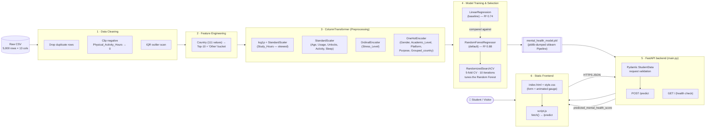

# Mental Health Signal — Student Wellness Score Prediction

Predicts a student's **Mental Health Score (0–10)** from their social-media usage, academic load, sleep, physical activity, and stress level, using a scikit-learn regression pipeline served over a FastAPI backend and consumed by a static HTML/CSS/JS frontend.

**🔗 Live app:** [mental-health-score-prediction-ankit.onrender.com](https://mental-health-score-prediction-ankit.onrender.com/)

> ⚠️ Not a clinical tool. This is a data-science/ML learning project — predictions are informational only, not a diagnosis.

---

## Table of Contents

1. [Architecture (HLD)](#architecture-hld)
2. [Repository Structure](#repository-structure)
3. [Dataset](#dataset)
4. [ML Pipeline Walkthrough](#ml-pipeline-walkthrough-model_selectionpy)
5. [Algorithms & Techniques Used](#algorithms--techniques-used)
6. [Backend API](#backend-api-mainpy)
7. [Frontend](#frontend)
8. [Running Locally](#running-locally)
9. [Deployment](#deployment)
10. [Known Limitations](#known-limitations)

---

## Architecture (HLD)



**Flow in one line:** raw CSV → clean → engineer features → `ColumnTransformer` preprocessing → train/compare/tune models → persist the whole fitted `Pipeline` with `joblib` → FastAPI loads it once at startup and exposes `/predict` → the static frontend posts form data as JSON and renders the returned score on a gauge.

---

## Repository Structure

```
Mental_Health_Score/
├── Student_Social_Media_And_Mental_Health_Impact.csv   # raw dataset (5,000 rows)
├── model_selection.py         # EDA, cleaning, feature engineering, training, tuning
├── main.py                    # FastAPI backend — loads the pickled pipeline, exposes /predict
├── mental_health_model.pkl    # joblib-serialized sklearn Pipeline (preprocessor + model)
├── requirements.txt           # backend dependencies
├── index.html                 # frontend markup (form + result gauge)
├── style.css                  # frontend styling
└── script.js                  # frontend logic — validation, fetch to API, rendering
```

---

## Dataset

**File:** `Student_Social_Media_And_Mental_Health_Impact.csv` — 5,000 rows × 13 columns.

| Column | Type | Role |
|---|---|---|
| `Age` | numeric | feature |
| `Gender` | categorical (nominal) | feature |
| `Country` | categorical (high-cardinality) | feature (engineered) |
| `Academic_Level` | categorical (nominal) | feature |
| `Most_Used_Platform` | categorical (nominal) | feature |
| `Purpose_Of_Use` | categorical (nominal) | feature |
| `Avg_Daily_Usage_Hours` | numeric | feature |
| `Daily_Unlocks` | numeric | feature |
| `Study_Hours` | numeric (right-skewed) | feature |
| `Physical_Activity_Hours` | numeric | feature |
| `Sleep_Hours_Per_Night` | numeric | feature |
| `Stress_Level` | categorical (ordinal: Low < Medium < High < Very High) | feature |
| `Mental_Health_Score` | numeric (0–10) | **target** |

---

## ML Pipeline Walkthrough (`model_selection.py`)

### 1. Exploratory Data Analysis
- Distribution of the target (`Mental_Health_Score`) via histogram + KDE.
- Correlation heatmap across numeric columns.
- `Stress_Level` vs. score boxplot — confirmed score drops step-wise as stress increases (Low → Very High), which justified ordinal encoding later.
- Scatter plots: `Avg_Daily_Usage_Hours` vs. score, `Sleep_Hours_Per_Night` vs. score.
- Platform usage counts (`Most_Used_Platform`).

### 2. Outlier Detection
- IQR rule per numeric column: `lower = Q1 - 1.5·IQR`, `upper = Q3 + 1.5·IQR`, flagged as a diagnostic (not auto-dropped).

### 3. Data Cleaning
- Dropped exact duplicate rows (`df.drop_duplicates()`).
- Found `Physical_Activity_Hours` had a physically impossible minimum of **-0.4** — clipped to `0` via `.clip(lower=0)` rather than dropped, since it's a data-entry glitch, not a real value.

### 4. Feature Engineering
- **High-cardinality handling:** `Country` has 111 unique values. One-hot encoding all of them would blow up dimensionality with mostly-empty columns; dropping the column loses real signal (internet access, culture, sleep norms correlate with geography). **Fix:** keep the top 10 most frequent countries as-is, bucket the rest into `"Other"` → new column `Grouped_country`.

### 5. Encoding Strategy
| Column group | Columns | Encoding | Why |
|---|---|---|---|
| Skewed numeric | `Study_Hours` | Impute → `log1p` → `StandardScaler` | Right-skewed; log-transform normalizes it before scaling |
| Plain numeric | `Age`, `Avg_Daily_Usage_Hours`, `Daily_Unlocks`, `Physical_Activity_Hours`, `Sleep_Hours_Per_Night` | Impute → `StandardScaler` | Already roughly normal, no skew fix needed |
| Ordinal | `Stress_Level` | Impute → `OrdinalEncoder(categories=[["Low","Medium","High","Very High"]])` | Has a real, meaningful order |
| Nominal | `Gender`, `Academic_Level`, `Most_Used_Platform`, `Purpose_Of_Use`, `Grouped_country` | Impute → `OneHotEncoder(handle_unknown='ignore')` | No natural order between categories |

A `SimpleImputer` is included in every branch even though this dataset has zero missing values — a safety net for real-world/API input that won't always be this clean.

### 6. Preprocessing Pipeline
All four branches above are combined into one `ColumnTransformer`, which is then chained into a full `sklearn.Pipeline` together with the model. This means the deployed API never has to know about scaling, encoding, or log-transforms — it just loads one object and calls `.predict()` on raw input.

### 7. Model Training & Comparison
Two pipelines (same preprocessor, different regressor) trained on a 70/30 train-test split (`random_state=42`):

| Model | R² (Test) | R² (Train) | MAE | MSE |
|---|---|---|---|---|
| Linear Regression | 0.7398 | 0.7237 | 0.5362 | 0.4570 |
| Random Forest (default) | **0.8780** | 0.9809 | 0.3465 | 0.2142 |

Random Forest wins on test R² by a wide margin — the train/test gap (0.98 vs 0.88) also shows some overfitting, motivating the tuning step below.

### 8. Hyperparameter Tuning
`RandomizedSearchCV` over the Random Forest step of the pipeline (`cv=5`, `n_iter=10`, `scoring='r2'`):

```python
param_grid = {
    'random forest__n_estimators': [100, 200, 300],
    'random forest__max_depth': [None, 10, 20, 30],
    'random forest__min_samples_split': [2, 5, 10],
    'random forest__min_samples_leaf': [1, 2, 4],
}
```
Best parameters found: `n_estimators=300, max_depth=30, min_samples_split=2, min_samples_leaf=1`.

### 9. Persistence
The **default** Random Forest pipeline (`rf_pipeline`) is serialized with `joblib.dump(..., 'mental_health_model.pkl')` and is what `main.py` loads at startup.

---

## Algorithms & Techniques Used

| Stage | Technique | Purpose |
|---|---|---|
| Outlier detection | IQR (Interquartile Range) rule | Flag values far from the typical range |
| Skew correction | `log1p` transform | Normalize right-skewed `Study_Hours` |
| Scaling | `StandardScaler` | Zero mean / unit variance for numeric features |
| Ordinal encoding | `OrdinalEncoder` | Preserve `Low < Medium < High < Very High` order |
| Nominal encoding | `OneHotEncoder` | Encode unordered categories without a false ranking |
| High-cardinality handling | Top-N + `"Other"` bucketing | Tame `Country`'s 111 raw categories |
| Baseline model | **Linear Regression** | Simple, interpretable regression benchmark |
| Final model | **Random Forest Regressor** | Ensemble of decision trees; captures non-linear feature interactions |
| Hyperparameter search | **RandomizedSearchCV** (5-fold CV) | Efficiently samples the Random Forest's hyperparameter space |
| Persistence | `joblib` | Serializes the entire fitted preprocessing + model `Pipeline` as one object |
| Serving | **FastAPI** + **Pydantic** | Input validation + REST endpoint over the loaded pipeline |

---

## Backend API (`main.py`)

FastAPI app with CORS enabled for all origins.

| Method | Path | Description |
|---|---|---|
| `GET` | `/` | Health check |
| `POST` | `/predict` | Runs the loaded pipeline on a `StudentData` payload, returns the predicted score |

**Request body (`StudentData`):**

```json
{
  "age": 21,
  "gender": "Male",
  "country": "India",
  "academic_level": "Undergraduate",
  "most_used_platform": "Instagram",
  "purpose_of_use": "Entertainment",
  "avg_daily_usage_hours": 4.5,
  "daily_unlocks": 80,
  "study_hours": 3.0,
  "physical_activity_hours": 1.5,
  "sleep_hours_per_night": 6.5,
  "stress_level": "Medium"
}
```

**Response (`PredictionResponse`):**

```json
{
  "predicted_mental_health_score": 6.77
}
```

Validation is enforced by Pydantic `Field` constraints (e.g. `age` between 10–100, hour fields between 0–24, and `Literal` types for every categorical field) — invalid input returns a `422` with per-field error details, which the frontend parses and maps back onto the form.

---

## Frontend

Plain HTML/CSS/JS, no framework/build step:

- **`index.html`** — a form (profile, academic & digital habits, lifestyle & stress) and a result panel with an animated SVG gauge.
- **`style.css`** — visual styling (Fraunces/Inter/JetBrains Mono via Google Fonts).
- **`script.js`** — client-side validation mirroring the API's Pydantic schema, `fetch()` to `POST /predict`, gauge animation, and error-state handling (network failures, `422` validation errors, non-2xx responses).

---

## Running Locally

**Backend:**
```bash
cd ML/Projects/Mental_Health_Score
python -m venv .venv && source .venv/bin/activate
pip install -r requirements.txt
uvicorn main:app --reload --port 2200
```

**Frontend:** serve the folder with any static server (e.g. VS Code's "Live Server") and open `index.html` — or open the file directly in a browser. Make sure `API_BASE` in `script.js` points at wherever the backend is actually running.

---

## Deployment

The app is deployed on **Render**:

- **Live app:** https://mental-health-score-prediction-ankit.onrender.com/

> ⚠️ **Check before relying on this:** [`script.js`](script.js) currently hardcodes `API_BASE = "https://ml-prep.onrender.com"`, which is a *different* host than the live link above. If the backend service was renamed/redeployed to `mental-health-score-prediction-ankit.onrender.com`, update `API_BASE` in `script.js` to match — otherwise the deployed frontend will be calling the wrong backend URL.

---

## Known Limitations

- **`main.py` uses `pandas` (`pd.DataFrame(...)`) inside `/predict` but never imports it** — this will raise a `NameError` at request time. Add `import pandas as pd` at the top of `main.py`.
- Render's free tier spins down on inactivity, so the first request after idle time may be slow (cold start).
- This is a correlational model trained on a single survey-style dataset — it should not be used for any real diagnostic or clinical purpose.
